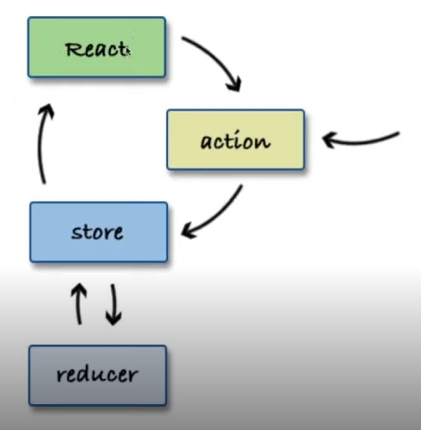

# Desenvolvimento de aplicações React

Em primeiro momento o assunto é a estilização (CSS) com o React

## Estilização com CSS

- 1. Inline
- 2. Classes
- 3. CSS in JS

### Inline

Cada propriedade é declara em uma variável. Exemplo:

```
const style = {
    color: blue;
    backgroundImage: url('path') 
};

function Component() {
    return (
        <div style={style}>Content</div>
    )
}
```

*Todo CSS é feito em camelCase, sem usar hífen (notar o backgroundImage)

### Classes

Divide as classes do CSS em arquivos modulares. É necessário importar esses arquivos no componente e utilizar as classes com a tag className. Exemplo:
```
// Arquivo Component.css
.div {
    margin: 2rem;
}

// Arquivo Component.js
import './Component.css'

function Component() {
    return (
        <div className=".div">Content</div>
    )
}
```

### CSS in JS

Abordagem sofisticada que o próprio javaScript gera o CSS. Usa o elemento CSS como se fosse um componente do React. Uma possibilidade dessa abordagem seria os Styled Components. Para instalar:
```
npm install styled-components
```
O código CSS ficará confinado em um componente semelhante ao que o React usa normalmente, recebendo props e tudo o mais. O código ficaria:
```
const DivStyle = styled.div`
        color:blue;
        background: url('${props => props.imageUrl}');
    `;

function TesteComponent() {
    const url = 'imageLink';
    return <DivStyle imageUrl={url}>Hello World</DivStyle>
} 
```

## Stateful vs Stateless Components

Stateful usa estados e o Stateless não usa. A partir dos hooks essa nomenaclatura precisou se adaptar. Antes, os componentes de classe que podiam ser utilizados para gerenciar estado, enquanto os componentes de função ficavam estáticos. No entanto, a partir da atualização que trouxe os hooks, o useState trouxe a possibilidade de tornar os componentes de função em stateful.

Exemplo de **useState** na prática:

```
import React, { useState } from 'react'

const Componente = () => {

    const [items, setItems] = useState(['Info inicial', 'Info inicial2'])

    const addItem = (item) => {
        setItems([...items, item])
    }

    return (
        <ul>
            {items.map((item) => <li>{item}</li>})
        </ul>
    )
}
```

## Formulários

Formulários mantém um estado interno no React. Em HTML o input, textarea e select possuem estado e com o React conseguimos manipulá-lo com useState e setState, mas é necessário fazer a ligação entre os DOMs.

Esses três elementos aceitam o atributo value e podemos mudar esse atributo com o onChange no React. A primeira abordagem seria o componente com ambiente controlado.

### Componente com ambiente controlado

Com o ambiente controlado, seria obrigatório utilizar o atributo onChange para monitorar o value. Exemplo disso na prática com Componentes de Classe seria:

```
import React from 'react';

class NameForm extends React.Component {
  constructor(props) {
    super(props);
    this.state = { value: '' };

    this.handleChange = this.handleChange.bind(this);
    this.handleSubmit = this.handleSubmit.bind(this);
  }

  handleChange(event) {
    this.setState({ value: event.target.value });
  }

  handleSubmit(event) {
    alert('O nome enviado foi: ' + this.state.value);
    event.preventDefault();
  }

  render() {
    return (
      <form onSubmit={this.handleSubmit}>
        <label>
          Nome:
          <input type="text" value={this.state.value} onChange={this.handleChange} />
        </label>
        <input type="submit" value="Submit" />
      </form>
    );
  }
}
```

### Componente não controlado

A tag input, em alguns tipos, é read-only e não tem como ser utilizada num ambiente controlado. O recomendado é que os que são possíveis seja feito de forma controlada. Exemplo disso na prática com Componente de Classe:

```
import React from 'react';

class FileInput extends React.Component {
  constructor(props) {
    super(props);
    this.handleSubmit = this.handleSubmit.bind(this);
    this.fileInput = React.createRef();
  }
  handleSubmit(event) {
    event.preventDefault();
    alert(
      `Arquivo selecionado - ${
        this.fileInput.current.files[0].name
      }`
    );
  }

  render() {
    return (
      <form onSubmit={this.handleSubmit}>
        <label>
          Upload de arquivo:
          <input type="file" ref={this.fileInput} />
        </label>
        <br />
        <button type="submit">Enviar</button>
      </form>
    );
  }
}
```


### Bibliotecas para forms

Como é muito verboso construir um form no React, várias bibliotecas surgiram. Indicações:

- Formik
- Redux-Forms

##

## Redux e fluxos de arquitetura com React

Flux é uma arquitetura que tem a função de realizar a comunicação entre componentes. É um padrão para o tráfego de dados de maneira unidirecional.

Action > Dispatcher > Store > View -> Esse ciclo se repete, saindo do view e voltando ao Action.

### Action

Formata a mensagem a ser enviada

### Dispatcher

Sabe todos os callbacks para diferentes Stores. Redireciona a Action para a Store correta.

### Store

Guarda todos os estados, as informações e todas as alterações têm que ser feitas pelo próprio store, mais ninguém.

### View

Recebe as notificações da store sobre as modificações e passa os dados para as visões abaixo dela.

A Arquitetura Flux possui diversas implementações, a mais popular dela é o Redux. Reflux, Mobx e Vuex também são utilizadas comumente.

Elas centralizam a informação e servem para realizar a comunicação entre componentes.

### Redux

É uma implementação do Flux, mas possui algumas diferenças entre a arquitetura básica do Flux. Veja o fluxograma:



#### 3 Princípios básicos:

- Single source of truth: Apenas uma store.
- State é read-only
- Mudanças são feitas com funções puras

#### Actions
Atuam como no Flux padrão, porém não mandam ao dispatcher (por não existir), apenas retornam a Action.

#### Store
Apenas uma store, ao contrário do Flux que possui várias.
Essa store cuida de toda a árvore de estados.
Os reducers cuidam de descobrir qual estado muda.

#### Reducers
Dicide os estados em pequenos reducers para descobrir como lidar com esse estado. Os estados são imutáveis.

#### Views
Em React, adiciona novos conceitos para conectar a View à Store: Provider (wrapper da árvore de componentes), connect() (conecta com o store) e selector (pega os updates dos estados)

### Abordagem prática

Para instalar no projeto React, é necessário rodar os comandos:
```
npm install react-redux
npm install --save-dev redux-devtools
```

O devtools além de ser instalado no projeto também precisa ser baixado como extensão no google chrome.

No index.js é necessário importar e realizar algumas configurações para criar o store: (pode ser adicionado mais de um reducer)
```
import { Provider } from 'react-redux'
import { createStore } from 'redux'
import { reducer } from './reducerspath'

const store = createStore(
  reducer,
  window.__REDUX_DEVTOOLS_EXTENSION__ && window.__REDUX_DEVTOOLS_EXTENSION__()
)

// O Provider vai ser um wrapper ao redor do component passando a store como props

ReactDOM.render(
  <Provider store={store}>
    <App />
  </Provider>,
  document.getElementById('root')
);

```

<!-- Encerrei as anotações por hora, no último vídeo da aula 2 de redux -->

## Comunicação Avançada entre as Aplicações

