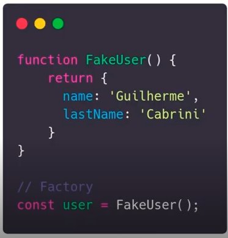

# Curso de JavaScript

Anotações fora do meu escopo de conhecimento ou agregaram bastante e decidi anotar. Omiti o que considero que já domino. 📖

## JavaScript

A linguagem continua evoluindo e precisa passar por um número de etapas para novas propostas de atualização. (ECMAScript Proposals)

É possível utilizar o Babel para verificar o seu código em outras versões (é um transpilador).

### Conceitos básicos

**- Interpretada:** O código é executado de cima para baixo e o resultado é imediatamente retornado. Não precisa transformar em algo diferente para que seja executada (que são as linguagens compiladas)

**- Tipagem fraca e dinâmica:** Ser fraca significa que eu posso concatenar dados de tipos diferentes, como por exemplo “inteiro + string”. Ser dinâmica ou estática significa que a variável armazenada na memória possui um tipo específico e não pode ser trocada no caso das estáticas, e dinâmica pode. Por isso que se usa o Typescript.

**- Funções de primeira classe e ordem maior:** podem ser atribuidas em uma variável, atribuída a uma estrutura de dados e pode ser usada como parâmetro/argumento de outra função. 

**- Closure:** Capacidade de uma função lembrar do ambiente que ela foi criada. Basicamente as relações de escopo entre escopo Global, Escopo de Bloco e Escopo de Função. As funções aninhadas dentro de outra função se LEMBRAM das variáveis declaradas na função anterior. 

**- Currying:** Transformar uma função com n parâmetros em apenas uma função que recebe um parâmetro e para cada parâmetro retorna uma função. Muito utilizado em programação funcional.

**- Hoisting:** Içamento das variáveis e das funções. A diferença entre os dois içamentos é que as variáveis são içadas, mas sem valor atribuído, então se a chamarmos antes da atribuição, o resultado será undefined. As funções são içadas como um todo, então se chamarmos uma função ANTES da declaração dela, ela funcionará perfeitamente.

**- Imutabilidade:** Conceito de linguagem funcional, as variáveis de tipos primitivos nunca mudam por métodos e se precisar muda-la cria uma nova. Em JavaScript o conceito é evitar fazer essas mudanças, mas é um desafio quando trabalhando com arrays e objetos, pois mesmo consts permitem redeclaração de suas propriedades.

*Nota:* Objetos e Arrays são passados para funções por referência na memória, ou seja, se modificarmos, modifica o Objeto/Array original. Uma boa prática é criar uma cópia rasa do Objeto. Com “...Objeto” na declaração de um novoObjeto.

### Tipos e Variáveis

**var ->** Não entende escopo de bloco. Apenas global ou de função

**const ->** Respeita escopo de bloco. Não pode ser alterada

**let->** Respeita escopo de bloco. Pode ser alterada

**string ->** Cadeia de caracteres

**number ->** Números

**null ->** Quando um valor é declarado como nulo usa-se esse tipo. (Cuidado, é considerado um objeto por baixo dos panos)

**undefined ->** Quando algum valor ainda não foi definido e está vazio. (Um null não proposital)

**boolean ->** true or false;

**symbol ->** Cria um símbolo de valor único

### Comandos

**string.length ->** Tamanho de caracteres da string

**string.split(‘’) ->** Divide a string em um array, o parâmetro principal é o que será utilizado para dividir. Se não passar nada vai dividir caractere por caractere.

**string.replace(texto, texto) ->** Substitui o texto da string. Primeiro argumento é o que vai ser substituído e o segundo é o texto que substituirá.

**string.slice(-1) ->** Corta uma parte da string. Com -1 retorna o último caractere. O normal é utilizar dois argumentos, o primeiro seria o começo e o segundo seria o fim.

**string.substr(); ->** Parecido com o slice, mas os argumentos funcionam diferente. Primeiro argumento é a posição da string que inicia o corte e o segundo argumento é a quantidade de caracteres.

**number.toString() ->** Transforma o número em uma string;

**number.toFixed(2) ->** Retorna o número com a quantidade de casas decimais passadas no argumento;

**parseFloat(string) e parseInt(string) ->** Retorna um tipo numérico a partir de uma string.

**Object.keys(user) ou Objeto.values(user) ->** Retorna os valores de um objeto em um array.

**Object.entries(user) ->** Retorna uma array de arrays, onde cada array-filho terá [0] Nome da prop [1] Valor.

**Object.assign(user, {propNova: valorNovo}) ->** Adiciona uma nova propriedade em um objeto. Pensando em imutabilidade isso não é recomendado.

**Object.freeze(user) ->** Não deixa o objeto sofrer alterações.

**Object.seal(user) ->** Não dá pra deletar nem criar, mas é possível alterar as props que já existem.

**switch-case ->** Para evitar muitos ifs em paralelo e com o código poluído. Sintaxe: *switch (variavel) {case condicional: console.log(x) case condicional2: console.log(y)}*

**for-in ->** Itera pelas propriedades (e não os valores) dos objetos. Sintaxe: *for(let variavel in objeto) {console.log(variavel)}*
**for-of ->** Itera pela propriedade [Symbol.iterator] dos objetos retornando seus valores. (se não tiver symbol.iterator for-of não funciona). Sintaxe: for(let variavel of objeto) {console.log(variavel)**

**array.from(array-like) ->** Pega um array-like ou objeto iterável e coloca dentro de um array. É possível usar no nodelist do DOM, por exemplo.

**array.unshift() ->** Adiciona um item no começo do array

**array.shift() ->** Remove do início

**array.concat(array2) ->** Concatena arrays e retorna um array novo

**array.slice() ->** Corta algumas posições de um array e retorna um array novo (parâmetros = posição)

**array.splice() ->** Não é imutável, remove do array os itens selecionados. (parâmetros = posição) Com mais parâmetros é possível remover e adicionar ao mesmo tempo.

**array.forEach((params) => { fn }) ->** Itera por cada elemento do array executando uma função. 

**array.flat() ->** Procura por recursividade no array, como, por exemplo, um array dentro do array, e retorna todos os itens no mesmo 'plano'.

**array.keys() // array.values() // array.entries() ->** Cria um iterator para cada elemento do array. com o arrayIterator.next() keys retorna os index, values retorna os valores no array e entries retorna um par "index-valor".

**array.find() ->** Procura no array e retorna o primeiro item que satisfaz à condição. Também existe a **array.findIndex()** que em vez de retornar o valor, retorna o index.

**Array.map(function) ->** A call-back function vai iterar pelo array (assim como forEach), mas vai retornar um NOVO ARRAY com as alterações realizadas pela call-back function. Primeiro parâmetro da call-back function é o item que está sendo iterado, o segundo o index.

**Array.filter(function) ->** Itera e forma um novo array com os elementos que passarem no teste condicional.

**Array.reduce(callbackfunction, acumulador) ->** Executa cada item do array olhando por alguma coisa e retorna apenas um valor. Primeiro parâmetro é o acumulador da callback, segundo parâmetro é o valor atual do array

**...array ->** Copia arrays ou objetos em uma nova variável, sem modificar o original. *const array1 = [“a”, “b”]. const array2 = [ ...array1, “c”].* Isso se chama Spread e é específico do ES6.

**array.firstIndexof(var) // array.lastIndexof(var) ->** Acha e retorna o index da primeira ou a última ocorrência do valor buscado.

**array.includes(var) ->** Retorna boolean se tem ou não a var dentro do array.

**array.some(callback) ->** Retorna se o array tem algum que passe pela condicional.

**array.every(callback) ->** Retorna se todos os itens do array passa pela condicional

**array.sort(callback) ->** Ordena um array a partir de alguma condição

**array.reverse() ->** Reverte a ordem do array

**array.join('-') ->** Retorna uma string separando os elementos por algum delimitador (no caso um -). Ex: [1, 2, 3] returns 1-2-3

**

## Orientação a objetos

- **Herança:** Baseada em protótipos. Cria um conjunto básico que outros objetos herdarão.
- **Classes:** Veio para simplificar o uso e manipulação do prototype na herança, as classes podem ser extensão de outras classes que efetuam a herança.
- **Moficadores de Acesso:** Define atributos privados e públicos dentro da classe (ainda não implementado). Com os acessores (getters e setters)
- **Encapsulamento:** Ocultar detalhes do funcionamento interno
- **Static:** Criado diretamente na classe, sem precisar instanciar objetos

##

## Design Patterns

São soluções generalistas para problemas recorrentes em desenvolvimento

1. *Padrões de Criação:* Abstraem e/ou adiam o processo de criação dos objetos
2. *Padrões Estruturais:* Se preocupam em como as classes e objetos são compostos para formar estruturas maiores
3. *Padrões Comportamentais:* Se concentram nos algoritmos e padrões de responsabilidade entre os objetos. Padrões de objetos, classes e de comunicação entre os objetos.

Mais utilizados:

### Factory
Toda função que retorna um objeto sem necessidade de um new são "de fábrica" (factory)

### Singleton
Cria uma única instância de uma função construtora e retorná sempre a mesma instância

Exemplo seria o jQuery.

P.S: Com os modules não é mais necessário

### Decorator
Recebe uma outra função como parâmetro e estende o seu funcionamento sem alterá-la explicitamente

### Observer
Subscriber e Observers. A instância mantém uma coleção de observadores e irá notifica-los das mudanças de Estado.

Artigo para <a href="https://oieduardorabelo.medium.com/padr%C3%B5es-em-js-observer-pattern-bff0ecc55d01">suporte<a>

### Module
Permite organizar melhor o código

## Manipulação de Arrays
